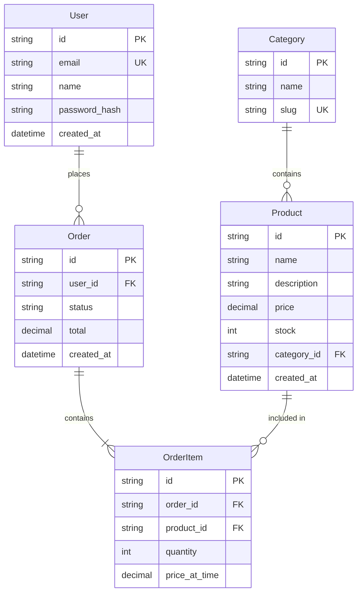

# SOP-101: Schema Design

## Purpose

Design a well-structured, normalized database schema that efficiently represents the data model, enforces integrity, and supports application queries. Good schema design prevents data anomalies and improves performance.

---

## Scope

- **Applies to:** All projects with relational databases
- **Covers:** Table design, relationships, constraints, indexes
- **Does not cover:** Query optimization, database administration

---

## Prerequisites

- [ ] SOP-000 (Requirements Gathering) completed
- [ ] SOP-100 (Database Selection) completed
- [ ] Data entities identified from requirements

---

## Procedure

### 1. Identify Core Entities

Extract entities from requirements. Look for nouns that represent data:

```
User Story: "As a customer, I want to place an order for products"

Entities: Customer, Order, Product
Relationships: Customer places Order, Order contains Products
```

**Entity Identification Questions:**

- What things does the app manage?
- What does the user interact with?
- What needs to be stored and retrieved?

### 2. Define Entity Attributes

For each entity, list attributes:

| Entity    | Attributes                                       |
| --------- | ------------------------------------------------ |
| User      | id, email, name, password_hash, created_at       |
| Product   | id, name, description, price, stock, category_id |
| Order     | id, user_id, status, total, created_at           |
| OrderItem | id, order_id, product_id, quantity, price        |

### 3. Identify Relationships

| Relationship         | Type        | Description                      |
| -------------------- | ----------- | -------------------------------- |
| User → Orders        | One-to-Many | A user can have many orders      |
| Order → OrderItems   | One-to-Many | An order has many items          |
| Product → OrderItems | One-to-Many | A product appears in many orders |
| Product → Category   | Many-to-One | Products belong to a category    |

### 4. Create ER Diagram

Use Mermaid for documentation:



### 5. Apply Normalization Rules

**First Normal Form (1NF):**

- No repeating groups
- Each cell contains a single value

❌ Bad: `products: "shirt,pants,shoes"`
✅ Good: Separate OrderItems table

**Second Normal Form (2NF):**

- 1NF + No partial dependencies
- All non-key columns depend on the entire primary key

**Third Normal Form (3NF):**

- 2NF + No transitive dependencies
- Non-key columns don't depend on other non-key columns

❌ Bad: OrderItem has `product_name` (depends on product_id)
✅ Good: Only store `product_id`, join to get name

### 6. Define Constraints

| Constraint Type | Usage                 | Example                        |
| --------------- | --------------------- | ------------------------------ |
| **Primary Key** | Unique identifier     | `id` on every table            |
| **Foreign Key** | Referential integrity | `user_id REFERENCES users(id)` |
| **Unique**      | Prevent duplicates    | `email` in users               |
| **Not Null**    | Required fields       | `name`, `email`                |
| **Check**       | Value validation      | `price > 0`                    |
| **Default**     | Auto-fill values      | `created_at DEFAULT NOW()`     |

### 7. Write Prisma Schema

Create `prisma/schema.prisma`:

```prisma
// prisma/schema.prisma

generator client {
  provider = "prisma-client-js"
}

datasource db {
  provider = "postgresql"
  url      = env("DATABASE_URL")
}

// ============================================
// Authentication & Users
// ============================================

model User {
  id            String    @id @default(cuid())
  email         String    @unique
  name          String
  passwordHash  String    @map("password_hash")
  role          Role      @default(USER)
  createdAt     DateTime  @default(now()) @map("created_at")
  updatedAt     DateTime  @updatedAt @map("updated_at")

  // Relations
  orders        Order[]

  @@map("users")
}

enum Role {
  USER
  ADMIN
}

// ============================================
// Products & Categories
// ============================================

model Category {
  id        String    @id @default(cuid())
  name      String
  slug      String    @unique
  createdAt DateTime  @default(now()) @map("created_at")

  // Relations
  products  Product[]

  @@map("categories")
}

model Product {
  id          String    @id @default(cuid())
  name        String
  description String?
  price       Decimal   @db.Decimal(10, 2)
  stock       Int       @default(0)
  imageUrl    String?   @map("image_url")
  isActive    Boolean   @default(true) @map("is_active")
  createdAt   DateTime  @default(now()) @map("created_at")
  updatedAt   DateTime  @updatedAt @map("updated_at")

  // Relations
  categoryId  String    @map("category_id")
  category    Category  @relation(fields: [categoryId], references: [id])
  orderItems  OrderItem[]

  @@index([categoryId])
  @@map("products")
}

// ============================================
// Orders
// ============================================

model Order {
  id        String      @id @default(cuid())
  status    OrderStatus @default(PENDING)
  total     Decimal     @db.Decimal(10, 2)
  notes     String?
  createdAt DateTime    @default(now()) @map("created_at")
  updatedAt DateTime    @updatedAt @map("updated_at")

  // Relations
  userId    String      @map("user_id")
  user      User        @relation(fields: [userId], references: [id])
  items     OrderItem[]

  @@index([userId])
  @@index([status])
  @@map("orders")
}

enum OrderStatus {
  PENDING
  CONFIRMED
  SHIPPED
  DELIVERED
  CANCELLED
}

model OrderItem {
  id          String   @id @default(cuid())
  quantity    Int
  priceAtTime Decimal  @db.Decimal(10, 2) @map("price_at_time")

  // Relations
  orderId     String   @map("order_id")
  order       Order    @relation(fields: [orderId], references: [id], onDelete: Cascade)
  productId   String   @map("product_id")
  product     Product  @relation(fields: [productId], references: [id])

  @@map("order_items")
}
```

### 8. Common Schema Patterns

#### Soft Deletes

```prisma
model Post {
  id        String    @id @default(cuid())
  deletedAt DateTime? @map("deleted_at")
  // ...
}
```

#### Polymorphic Relations

```prisma
model Comment {
  id            String  @id @default(cuid())
  content       String
  commentableId String  @map("commentable_id")
  commentableType String @map("commentable_type") // "Post" | "Video"
}
```

#### Self-referential (Tree)

```prisma
model Category {
  id       String     @id @default(cuid())
  name     String
  parentId String?    @map("parent_id")
  parent   Category?  @relation("CategoryTree", fields: [parentId], references: [id])
  children Category[] @relation("CategoryTree")
}
```

#### Many-to-Many with Extra Fields

```prisma
model User {
  id          String       @id @default(cuid())
  memberships Membership[]
}

model Team {
  id          String       @id @default(cuid())
  memberships Membership[]
}

model Membership {
  id     String @id @default(cuid())
  role   String @default("member")
  userId String @map("user_id")
  teamId String @map("team_id")
  user   User   @relation(fields: [userId], references: [id])
  team   Team   @relation(fields: [teamId], references: [id])

  @@unique([userId, teamId])
  @@map("memberships")
}
```

### 9. Add Strategic Indexes

Index columns used in:

- WHERE clauses
- JOIN conditions
- ORDER BY clauses
- Foreign keys

```prisma
model Product {
  // ...

  @@index([categoryId])          // Filter by category
  @@index([isActive, createdAt]) // Active products sorted by date
  @@index([name])                // Search by name
}
```

### 10. Document Schema

Create `/docs/database/schema.md`:

```markdown
# Database Schema

## Overview

This document describes the database schema for [Project Name].

## Entity Relationship Diagram

[Include Mermaid diagram]

## Tables

### users

| Column        | Type      | Constraints              | Description       |
| ------------- | --------- | ------------------------ | ----------------- |
| id            | CUID      | PK                       | Unique identifier |
| email         | VARCHAR   | UNIQUE, NOT NULL         | User email        |
| name          | VARCHAR   | NOT NULL                 | Display name      |
| password_hash | VARCHAR   | NOT NULL                 | Hashed password   |
| role          | ENUM      | NOT NULL, DEFAULT 'USER' | User role         |
| created_at    | TIMESTAMP | NOT NULL, DEFAULT NOW    | Creation time     |
| updated_at    | TIMESTAMP | NOT NULL                 | Last update time  |

### products

[Continue for each table...]

## Indexes

| Table    | Index                 | Columns     | Purpose            |
| -------- | --------------------- | ----------- | ------------------ |
| products | idx_products_category | category_id | Filter by category |
| orders   | idx_orders_user       | user_id     | User's orders      |
| orders   | idx_orders_status     | status      | Filter by status   |
```

---

## Review Checklist

- [ ] All entities from requirements identified
- [ ] ER diagram created
- [ ] Schema is normalized (3NF minimum)
- [ ] Primary keys defined
- [ ] Foreign keys with proper cascades
- [ ] Unique constraints where needed
- [ ] Indexes on query columns
- [ ] Prisma schema file created
- [ ] Schema documentation complete

---

## AI Agent Prompt Template

```
Design the database schema for this project.

Read:
- `/docs/requirements.md` for data requirements
- `/docs/database/database-decision.md` for database choice

Execute SOP-101 (Schema Design):
1. Identify entities and relationships from requirements
2. Create ER diagram using Mermaid
3. Write Prisma schema in prisma/schema.prisma
4. Add appropriate indexes
5. Document schema in /docs/database/schema.md
```

---

## Outputs

- [ ] `prisma/schema.prisma` — Prisma schema definition
- [ ] `/docs/database/schema.md` — Schema documentation with ER diagram

---

## Related SOPs

- **SOP-100:** Database Selection (database type)
- **SOP-102:** Seed Data (initial data)
- **SOP-202:** API Design (schema informs API)
